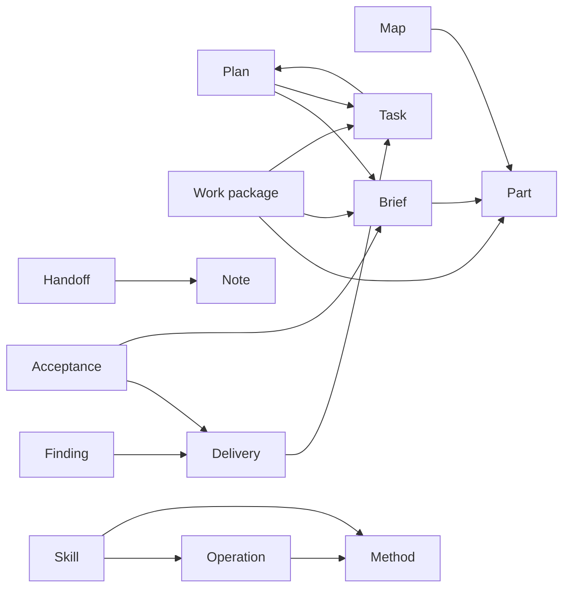

<!--
FORMAT. This file indexes the authoritative term clusters under glossary/. Read the cluster relevant to the selected part or task. Each cluster starts with its own entry format. The diagram is a concise view of the explicitly named relationships in those definitions; entries supply the meaning. Use terms to resolve project ambiguity rather than treating every ordinary word as a required entry.
-->

# Atlas vocabulary

These terms describe the current release plan and proposed architecture. The older skill sources and templates are being migrated by the work packages.

| Cluster | Read for | Definitions |
|---|---|---|
| Homes | Project knowledge and ownership | [Home, Glossary, Map, Plan, Decision, Note, Part](glossary/homes.md) |
| Work | Scope, progress, evidence, and resumption | [Work package, Brief, Task, Delivery, Acceptance, Integration, and statuses](glossary/work.md) |
| Methods | Reusable reasoning and operation boundaries | [Atlas, Skill, Operation, Method, Interview, Prototype, Context pointer, Project workflow](glossary/methods.md) |

A task's acceptance and a project's integration are separate facts. A method supplies reasoning; an operation owns the resulting changes to the work record. [Decision 0012](decisions/0012-atlas-owns-work-projects-own-delivery.md) proposes the boundary, and [core-model/01](plan/core-model/01-settle-boundaries.md) records its adoption.
