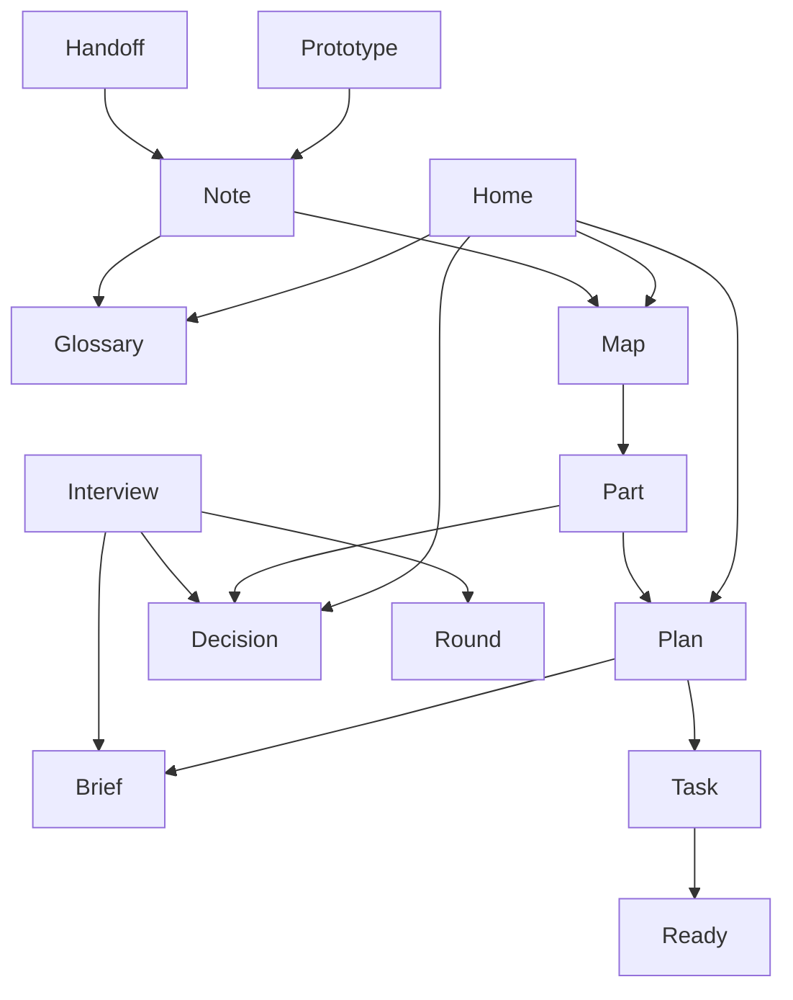

<!--
FORMAT. Agents: read this before editing. It is not rendered.
- One entry per term this project owns. General concepts stay out.
- Entry shape: **Term**: one or two sentences saying what it IS. Then `_Avoid_: the synonyms`. Then, only when a neighbour is easily confused with it, `_Not_: the neighbour, and the one-phrase difference`.
- Pick one word per concept. The others go under Avoid.
- No implementation detail. This file is a glossary and nothing else.
- Group entries under ### headings when clusters emerge. When the file outgrows a screen, move each cluster to glossary/<cluster>.md and keep this file as the index with the diagram.
- The diagram shows how terms relate: an edge points from a term to a term its definition names, and a term is a node only when it has an edge. Redraw it after editing entries.
-->

# Atlas

The vocabulary of the Atlas method and the skills that run it.

## Language

### The five things

**Glossary**:
The file holding the words a project owns, one entry per concept, with the synonyms to avoid.
_Avoid_: context, ubiquitous language

**Map**:
The file holding the shape of the thing being built: one diagram and one section per part, each with a status and its target state.
_Avoid_: architecture doc, overview, system design

**Part**:
One box on the map. A part has a status, a purpose, open questions, and links to its decisions and plan.
_Avoid_: box, component, module, container, area

**Plan**:
The home of the work: one folder per part holding a brief and its tasks, or the repo's GitHub issues when the project chose that when the five things were created.
_Avoid_: backlog, tracker, .scratch

**Home**:
One of the five things: the single place a kind of truth lives. If it is true today it is in a home; if it was true on a date it is a note.
_Avoid_: doc, artifact

**Brief**:
The written account of what a part must do and why, including its settled choices, written when the part is decided.
_Avoid_: spec, PRD, requirements

**Task**:
One file in a part's plan: a complete slice of work sized for one session, declaring which tasks block it.
_Avoid_: ticket, story (issue is the same thing in GitHub mode)

**Ready**:
The state of a task whose blocking tasks are all done. Ready tasks are what `/build-it` picks from.
_Avoid_: frontier, unblocked

**Decision**:
A short file recording a choice that is hard to reverse, material in impact, or could surprise a future reader.
_Avoid_: ADR, architecture decision record

**Note**:
A dated, write-once file in `notes/`: a handoff, a prototype verdict, research, a review.
_Avoid_: evidence, scratch, handoff doc

### Statuses

**Sketched**:
A part that exists on the map but has not been interviewed.
_Avoid_: fog, open, todo

**Decided**:
A part whose open questions are answered and whose decisions are written.

**Building**:
A part with at least one task in progress.

**Done**:
A part whose tasks are all done and reviewed.

### The method

**Atlas**:
The method (the five things) and the skill set that runs it.

**Skill**:
One `SKILL.md` folder a coding agent loads, doing one job in the method.

**Interview**:
The relentless questioning that settles a part: rounds of numbered questions, each with a recommended answer, facts found by the agent, decisions made by the human.
_Avoid_: grilling, grill

**Handoff**:
A note that pauses a session so a fresh one can resume it.

**Round**:
One batch of numbered questions in an interview, each with a recommended answer, answered by the human before the next batch is asked.
_Avoid_: batch, turn, pass

**Prototype**:
The smallest made thing that answers one question a part's interview could not, kept under `prototypes/` and pointed to by its note. Tasks may copy from it and never link to it.
_Avoid_: spike, POC, experiment
