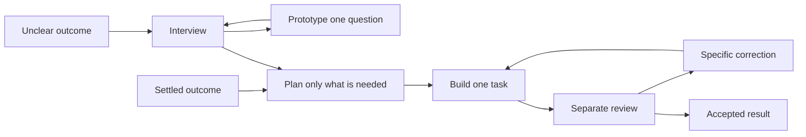

# A simple guide to Atlas

Atlas helps you keep a project's purpose, choices, work, and evidence understandable across sessions. Start with the outcome you want. Use only the steps that help the current work.

This guide describes the implemented process candidate, not a tagged release. The [candidate task](plan/work-skills/07-integrated-process-candidate.md) records its checks and remaining limits. Existing projects need an explicit format adoption; installing new skills alone does not rewrite their records.

## The everyday process

1. **Set up once:** run `/setup-atlas` to adopt the project and preserve its existing work and delivery rules.
2. **Choose a result:** if it is unclear, use `/interview-me <part>`. If the brief already settles it, go straight to planning or an existing task.
3. **Plan enough:** `/plan-it <part>` creates or updates useful, checkable tasks. A small change can be one task.
4. **Make it:** `/build-it <task>` delivers that task, checks the result, and records anything still needed.
5. **Review it:** invoke `/review-it <task>` separately. A finding returns specific work to the builder; a clean result becomes accepted.

Run `/atlas` when you need orientation. You can name a part or task to keep it focused. It reports current work and a useful next action; it does not execute a chain of skills.

An arrow is the next useful action, not an automatic invocation. The correction and experiment paths require new evidence, a changed result, or a decision. If nothing can advance, Atlas records what it is waiting for.

## Where things belong

| Home | What belongs there | What links to it |
|---|---|---|
| `GLOSSARY.md` | Project-specific meanings that prevent confusion | Briefs and work use the terms; split glossaries keep an index |
| `MAP.md` | Responsibilities, their purposes, decision dependencies, and open questions | Each part points to its brief, decisions, and any detail view |
| `plan/` | Briefs, tasks, work dependencies, attempts, checks, and acceptance | The map and handoffs point to the authoritative work record |
| `decisions/` | Consequential choices, reasons, adoption state, and what they replace | Relevant briefs and map sections link the decision |
| `notes/` | Dated research, experiments, reviews, and missing session context | Current records link useful evidence rather than copying it |

The actual deliverable stays wherever the project needs it: source code, a document folder, a design tool, a dataset, or another system. Atlas records where it is and how it was checked.

## How to organise a project

**Make a part for an independently understandable responsibility or outcome.** A website might have membership, publishing, and support. An event might have programme, venue, and registration. A research project might have questions, data collection, and analysis when each has its own outcome and decisions. Use the project's real structure; Atlas does not impose a universal category list.

Start with a small map and let evidence reveal the detail. Do not manufacture tasks for questions that cannot yet be stated precisely. Keep current uncertainty separate from work deliberately excluded from the brief.

A part has a stable id. Its display name and position can change without changing task identities. Split a long map into linked views when navigation becomes difficult; there is no mandatory number of parts. Each part keeps one authoritative section, and every move repairs incoming links. A diagram shows those sections; it does not become a second editable account of the project.

Use two kinds of dependency:

- **Part Needs:** a decision in another part must be settled first.
- **Task blockers:** this task needs another task's accepted output, accessible in the workspace where it will be used.

Add labels or another index only when real retrieval needs them. You should be able to start at a map part, follow its brief, and find the relevant tasks, decisions, and evidence without reading the entire project.

## What each skill does

The linked files are the actual agent instructions. They contain the essential sequence, useful method pointers, and how to finish or resume. Shared fields and transitions live in the project formats rather than being repeated in every skill.

| Skill | Your purpose | What its instructions tell the agent |
|---|---|---|
| [setup-atlas](skills/setup-atlas/SKILL.md) | Adopt a new or existing project | Discover what exists, create or explicitly adapt missing homes, preserve authority and custom content, verify the links |
| [atlas](skills/atlas/SKILL.md) | Know where to go next | Inspect the selected work, prefer current evidence over old notes, recommend an action or explain a wait, change nothing |
| [interview-me](skills/interview-me/SKILL.md) | Settle a meaningful uncertainty | Investigate facts, ask dependent questions in useful rounds, record answers as they settle, stop when the selected work is clear |
| [plan-it](skills/plan-it/SKILL.md) | Turn scope into manageable work | Reuse existing work, create verifiable tasks, preserve identities, check dependencies, account for changed scope |
| [build-it](skills/build-it/SKILL.md) | Deliver or resume one task | Check readiness and actual inputs, preserve partial work, make and verify the output, record delivery or an exact stop |
| [review-it](skills/review-it/SKILL.md) | Decide whether the result meets the request | Examine the actual output and requirements, check criteria and conventions, record acceptance or actionable findings |
| [map-it](skills/map-it/SKILL.md) | Keep the structure understandable | Repair links and views, preserve stable identities, separate reorganisation from changed responsibilities |
| [prototype-it](skills/prototype-it/SKILL.md) | Answer a question by trying something | Define the deciding observation, make a bounded experiment, distinguish measurement from preference, preserve the answer and limits |
| [park-it](skills/park-it/SKILL.md) | Continue later without losing context | Keep current records useful, capture only missing session context, identify the exact target, workspace, and next action |

## How progress and changes work

A task moves from **todo → doing → review → done**. Cancellation is a separate state with a reason; canceled work does not supply an accepted output. Waiting is recorded on the task without adding another status system.

A delivery says what was made, where it is, what was checked, and what remains. Its short identity covers the actual output; a separate scope identity covers the requirements it answers to. The agent can use the included helper for files. You do not need to calculate hashes yourself.

When files or requirements change, Atlas keeps prior evidence and renews the affected checks. It does not reject unrelated accepted work or reuse stale human approval. Existing Git or artifact versioning can retain previous results; otherwise a copy is retained before an accepted result is replaced.

A **part is done when its combined result meets the brief**. Accepted logo exports do not complete a part that also promised a missing usage guide. Keep the exports accepted and plan the guide. Map maintenance cannot turn a count of completed tasks into acceptance.

When a problem repeats, the record must explain the missing answer, unavailable output, or next useful investigation. Running the same command again without new information should report that wait, not recreate the task, repeat an interview, or alternate between build and review.

## Adapt the checks to the project

| Work | Useful evidence |
|---|---|
| Software | Observable behavior, relevant tests, and required project checks |
| Document or research | Claims checked against sources, and rendered layout when appearance matters |
| Data | Reconciliation against source records, units, totals, and boundary cases |
| Brand or design | Realistic variants and inspection at intended sizes; the person's preference where needed |
| Event, rollout, or process | Verified dependencies, actual state, a rehearsal, or confirmation from the responsible person |

The shared process organises the work; it cannot replace domain expertise, unavailable evidence, or a person's judgment. An honest unresolved result is useful when it names exactly what can settle it.

Atlas follows the project's rules for saving, committing, sharing, and publishing. A clean review is acceptance of the result, not permission to merge or publish it.

## What changed in this candidate

Matt Pocock's skills inform the reusable interview, diagnosis, testing, and prototype techniques. Atlas keeps their useful reasoning while bounding it to the current outcome and preserving a shared project record. See the [source comparison](notes/2026-09-19-research-atlas-matt-segmented-framework.md) and attribution in the method files.

The candidate removes fixed question and output counts, mandatory vocabulary for ordinary words, automatic defaults for skipped decisions, repeated generic confirmations, and completion inferred from task counts. It retains explicit ownership, meaningful checks, stable identity, a usable pending action, and separate review. Its [validation record](plan/work-skills/07-integrated-process-candidate.md) distinguishes tested cases from installation and human acceptance still to come.
