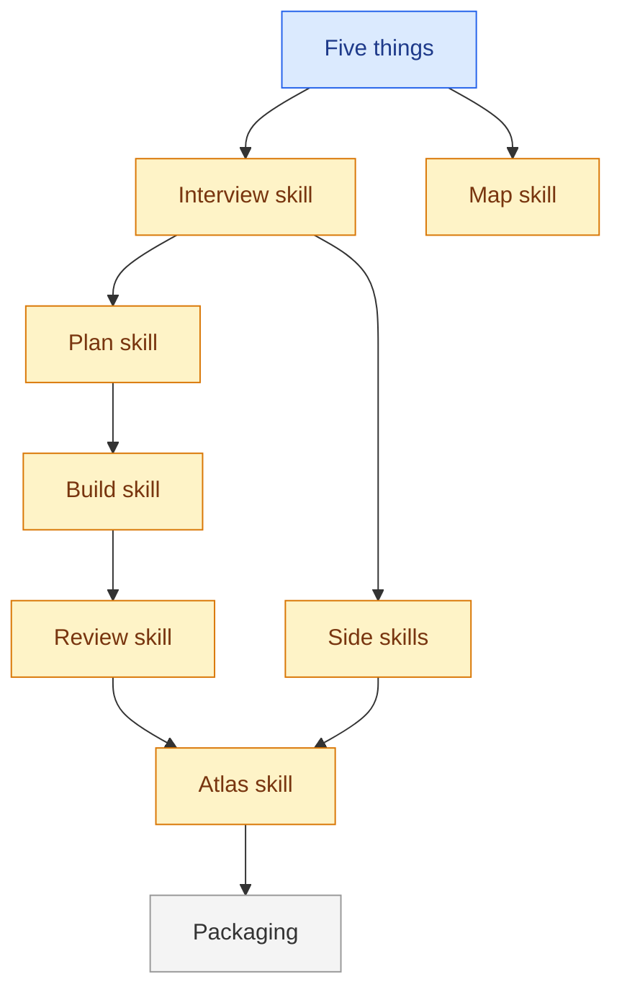

<!--
FORMAT. Agents: read this before editing. It is not rendered.
- Level 1: one paragraph on what this thing is and who or what it touches, then the diagram.
- One ## section per part. The heading, lowercased with dashes, is the part id. Diagram node ids must match, and node labels are the headings.
- Each part carries, in this order: **Status:** sketched | decided | building | done. One purpose line. Needs: the ids of the parts that must be decided before this one, or none. Open questions: `none`, or one `- ` line per question. Decisions (links). Plan (link to plan/<part>/, or to the parent issue).
- An open question may start with a marker: `(prototype)` when only a made thing can answer it; `(answered, see notes/<file>) <verdict>` once one has, until the interview copies the verdict into the brief or a decision and removes the line.
- Part ids are unique across the whole map, including parts split into their own files. A split file starts with `part:` frontmatter and no status; the status line in this file is the truth, derived from the sub-parts: done when all are done, building when any is building, decided when all are at least decided, otherwise sketched.
- At most nine parts per diagram, flat, no subgraphs. When a part outgrows a screen, move its body to map/<part>.md (which gets its own diagram and sub-parts) and leave the status line and a link.
- The diagram is derived: `flowchart LR`, one node per section coloured by status with the four classes below, one unlabelled edge per Needs entry pointing from the needed part to the part that needs it. Regenerate it from the sections, never the other way round. A skill that moves a status also changes its own node's class; `/map-it` makes the whole block true again.
-->

# Atlas

Atlas is a set of agent skills plus a file layout (the five things) that take an idea from fuzzy to finished in any domain. It touches a coding agent (Claude Code, Codex, Cursor and others via skills.sh), the project folder it runs in, and optionally GitHub issues.

## Five things

**Status:** decided
The file layout every project gets: `GLOSSARY.md`, `MAP.md`, `plan/`, `decisions/`, `notes/`, all at the root, each self-describing.
Needs: none.
Open questions: none.
Decisions: [0002](decisions/0002-five-things-at-the-root.md), [0004](decisions/0004-self-describing-files.md), [0006](decisions/0006-plain-words-over-jargon.md), [0011](decisions/0011-the-home-wins.md).
Plan: none yet.

## Atlas skill

**Status:** building
`/atlas` reads the five things and prints five lines: parts by status, ready tasks, newest note (and whether a handoff is live), problems, the next command. On a fresh project it creates the five things from `skills/atlas/templates/`, writes the versioned block into `CLAUDE.md` or `AGENTS.md`, offers `git init` when there is no repo, and, when a GitHub remote exists, asks one round for the tracker and the merge line. Every later run is a status check that keeps what exists and asks nothing. `/atlas go` follows the sibling `build-it` and `review-it` skills and keeps going while no human is needed.
Needs: review-skill, side-skills.
Open questions: none.
Decisions: none yet.
Plan: none yet.

## Interview skill

**Status:** building
`/interview-me` runs rounds of numbered questions with recommended answers, writing terms, map changes, and decisions as they land. On the whole project it drafts the map from what exists and questions the draft; on one part it asks until the open questions are gone, writes the brief, and moves the part to decided. A decided or building part can be re-interviewed; its status stays and its brief changes.
Needs: five-things.
Open questions: none.
Decisions: [0005](decisions/0005-one-interview-for-both-levels.md).
Plan: none yet.

## Map skill

**Status:** building
`/map-it` changes the shape only. Bare, it regenerates the map and glossary diagrams from their sections and reports drift; with a part id it splits that part into `map/<part>.md`. New parts come from `/interview-me`; statuses are moved by the skill that causes the change, and a split part's status is recomputed by `/atlas`.
Needs: five-things.
Open questions: none.
Decisions: [0003](decisions/0003-mermaid-in-markdown.md).
Plan: none yet.

## Plan skill

**Status:** building
`/plan-it` turns a decided part's brief into tasks with blocking edges, then runs one sizing round with the human. Files in `plan/<part>/`, or sub-issues under the part's parent issue when the project tracks in GitHub. A part has a plan once it has a task. On a re-run it touches todo tasks only.
Needs: interview-skill.
Open questions: none.
Decisions: [0001](decisions/0001-one-home-for-the-plan.md), [0009](decisions/0009-one-task-id-everywhere.md).
Plan: none yet.

## Build skill

**Status:** building
`/build-it` works one ready task, one per run, in the medium its Delivers line names and in the way the project already makes that kind of thing, then records what it made, where, and what it verified under Delivered. It moves the task to doing, the part to building, and the task to review when Delivered is written. With a `github` tracker it works on a branch, opens a PR, and returns to the default branch; otherwise it works in place and commits in a repo. A brief that is wrong or silent sends the question to the map and stops with `Next: /interview-me`.
Needs: plan-skill.
Open questions: none.
Decisions: [0007](decisions/0007-branches-only-with-github.md), [0010](decisions/0010-waits-are-on-disk.md).
Plan: none yet.

## Review skill

**Status:** building
`/review-it` runs two checks on a task's result, in a fresh context when the harness has one: does it match the brief, and does it follow the project's conventions (the glossary, the decisions, and how existing things of that kind are made). Findings go on the task, one dated pass per run, and send it back to doing; `(you)` boxes are listed for the human to tick in the file. A clean review moves the task to done, merges or hands over per the merge line, and moves the part to done when it was the last task.
Needs: build-skill.
Open questions: none.
Decisions: none yet.
Plan: none yet.

## Side skills

**Status:** building
`/prototype-it` makes the smallest thing that answers one part's open question, under `prototypes/<part>-<slug>/`, reports what it shows, takes the human's verdict, files it as a note, and writes the answer back onto the part's open question. `/park-it` pauses into a dated note that `/atlas` resumes from and commits everything in the five things, not only the note.
Needs: interview-skill.
Open questions: none.
Decisions: none yet.
Plan: none yet.

## Packaging

**Status:** sketched
Flat `skills/<name>/` folders, a Claude plugin manifest, a skills.sh listing, a README that doubles as the docs page, and the blog post.
Needs: atlas-skill.
Open questions: none.
Decisions: none yet.
Plan: none yet.
