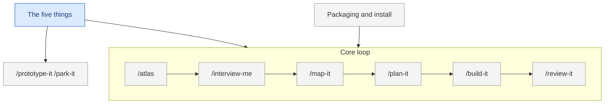

<!--
FORMAT. Agents: read this before editing. It is not rendered.
- Level 1: one paragraph on what this thing is and who or what it touches, then the diagram.
- One ## section per part. The heading, lowercased with dashes, is the part id. Diagram node ids must match.
- Each part carries, in this order: **Status:** sketched | decided | building | done. One purpose line. Open questions. Decisions (links). Plan (link to plan/<part>/).
- Part ids are unique across the whole map, including parts split into their own files. A split file starts with `part:` frontmatter and no status; the status line in this file is the truth.
- Seven to nine parts per diagram at most. When a part outgrows a screen, move its body to map/<part>.md (which gets its own diagram and sub-parts) and leave the status line and a link.
- Colour by status with the four classes below. Regenerate the diagram from the sections, never the other way round.
-->

# Atlas

Atlas is a set of agent skills plus a file layout (the five things) that take an idea from fuzzy to finished in any domain. It touches a coding agent (Claude Code, Codex, Cursor and others via skills.sh), the project folder it runs in, and optionally GitHub issues.

## Five things

**Status:** decided
The file layout every project gets: `GLOSSARY.md`, `MAP.md`, `plan/`, `decisions/`, `notes/`, all at the root, each self-describing.
Open questions: none.
Decisions: [0002](decisions/0002-five-things-at-the-root.md), [0004](decisions/0004-self-describing-files.md), [0006](decisions/0006-plain-words-over-jargon.md).
Plan: none yet.

## Atlas skill

**Status:** sketched
`/atlas` reads the five things and prints five lines: parts by status, ready tasks, newest note, the next command. On a fresh project it scaffolds the five things from `skills/atlas/templates/`, writes the versioned block into `CLAUDE.md` or `AGENTS.md`, asks the tracker question when a GitHub remote exists, offers `git init` when there is no repo, and recommends `Merge: human` when the repo has more than one collaborator. Every later run is a status check: it never re-scaffolds, never re-asks, and reports a missing repo in one word.
Open questions: whether it asks for a one-sentence purpose when there is no README. What it checks beyond status (decisions with no map link, tasks blocked by missing tasks).
Decisions: none yet.
Plan: none yet.

## Interview skill

**Status:** sketched
`/interview-me` runs rounds of numbered questions with recommended answers, writing terms, map changes, and decisions as they land. Scope is the whole project or one part.
Open questions: whether one skill handles both the foggy multi-session effort (Matt's wayfinder) and the single-session sharpening. Proposed yes, via the map's zoom.
Decisions: [0005 (proposed)](decisions/0005-one-interview-for-both-levels.md).
Plan: none yet.

## Map skill

**Status:** sketched
`/map-it` draws or redraws the diagram from the sections, zooms into one part, moves statuses, and splits a grown part into `map/<part>.md`.
Open questions: layout rules to bake in (direction, node limit, status classes). Whether it can run without an interview first.
Decisions: [0003](decisions/0003-mermaid-in-markdown.md).
Plan: none yet.

## Plan skill

**Status:** sketched
`/plan-it` turns a decided part into a brief and tasks with blocking edges, in one pass, then quizzes the human on granularity. Files in `plan/<part>/`, or a parent issue with sub-issues when the project tracks in GitHub.
Open questions: whether the brief needs user stories for non-software projects.
Decisions: [0001](decisions/0001-one-home-for-the-plan.md).
Plan: none yet.

## Build skill

**Status:** sketched
`/build-it` works one ready task in whatever medium it needs, reading the brief, glossary, and decisions first, then records what it delivered on the task.
Open questions: how it detects the medium (code, copy, configuration, assets). Whether it commits.
Decisions: none yet.
Plan: none yet.

## Review skill

**Status:** sketched
`/review-it` checks a task's result on two axes: does it match the brief, and does it follow the project's conventions and vocabulary.
Open questions: what "conventions" means for a non-code project. Whether findings go to the task file or a note.
Decisions: none yet.
Plan: none yet.

## Side skills

**Status:** sketched
`/prototype-it` answers one question with a throwaway thing and files the verdict as a note. `/park-it` pauses into a dated note that `/atlas` resumes from.
Open questions: none.
Decisions: none yet.
Plan: none yet.

## Packaging

**Status:** sketched
Flat `skills/<name>/` folders, a Claude plugin manifest, a skills.sh listing, a README that doubles as the docs page, and the blog post.
Open questions: none.
Decisions: none yet.
Plan: none yet.
