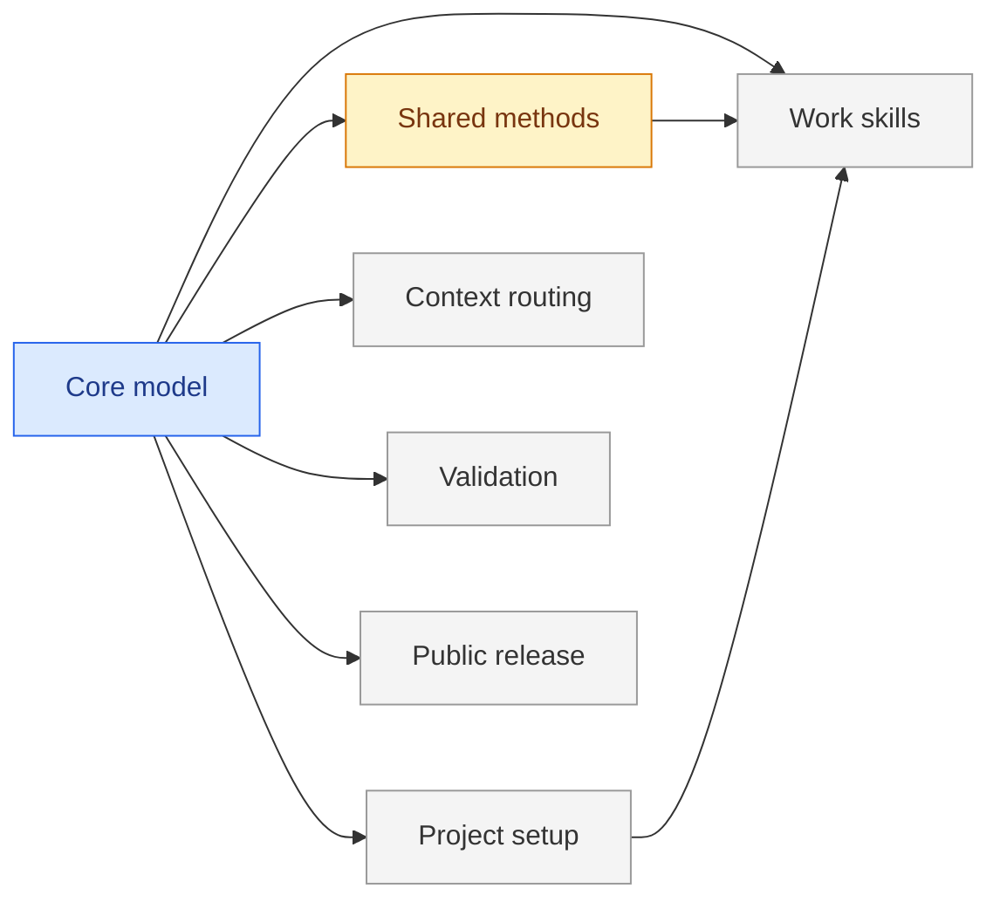

<!--
FORMAT. Agents: read before editing.
This map describes current release-work ownership. Each ## section is a part with a globally unique heading-derived id, Status, purpose, Needs, Open questions, Decisions, and Plan. Needs means decision prerequisites, while task blocked_by fields own execution order. Status is sketched until its scoped direction is adopted, decided once adopted, building when work is active, and done when its scoped outcome has current acceptance evidence. A planning brief can exist before adoption. The diagram is derived: flowchart LR, one node per section, class from status, one edge from each needed part to its dependent. Keep at most nine parts in this view and preserve identity when splitting.
-->

# Atlas public revision

Atlas is Vitali Liouti's project method: five homes for durable knowledge, operations for work, reusable methods for reasoning, and project-owned delivery policy. This map groups the work needed to finalize the public revision; the installed skill sources remain the earlier draft. [INDEX.md](INDEX.md) routes reads and [the plan](plan/README.md) supplies the execution order. The former skill-by-skill map is retained in the [initial snapshot](notes/archive/2026-09-13-initial-review/MAP.md).

## Core model

**Status:** decided
Define the boundary between Atlas work, reusable methods, project delivery, and evidence so every consumer can make the same state decision.
Needs: none.
Open questions: Task 02 defines the evidence fields and transitions; task 03 defines and tests migration. The boundary choices are adopted in core-model/01.
Decisions: [0012](decisions/0012-atlas-owns-work-projects-own-delivery.md), [0013](decisions/0013-local-tasks-first.md), [0018](decisions/0018-one-method-modular-skills.md), [0019](decisions/0019-acceptance-follows-output-and-scope.md), [0020](decisions/0020-decide-only-the-selected-scope.md).
Plan: [plan/core-model/](plan/core-model/).

## Shared methods

**Status:** building
Provide reusable interviewing, diagnosis, verification, and prototype methods with precise triggers and useful outputs, authored once and packaged for their consumers.
Needs: core-model.
Open questions: Task 01 still settles the interviewing method. Task 05 settles bundling and whether any method is used on its own. Tasks 02, 03, and 04 are done.
Decisions: [0014](decisions/0014-shared-methods-travel-with-consumers.md).
Plan: [plan/shared-methods/](plan/shared-methods/).

## Project setup

**Status:** sketched
Adopt the five things safely and point Atlas at existing project delivery policy while keeping repeated setup idempotent.
Needs: core-model.
Open questions: Choose how to expose an unresolved policy choice; how managed-block versions coexist with custom edits; how non-Git projects stay simple.
Decisions: [0015](decisions/0015-setup-adopts-routing-observes.md).
Plan: [plan/project-setup/](plan/project-setup/).

## Work skills

**Status:** sketched
Give all eight Atlas operations explicit reads, owned changes, completion evidence, and recovery, with local canonical work and project-owned delivery.
Needs: core-model, shared-methods, project-setup.
Open questions: Choose the smallest useful read scope and retry receipt per operation; decide how to report integration pending without redefining review.
Decisions: [0012](decisions/0012-atlas-owns-work-projects-own-delivery.md), [0013](decisions/0013-local-tasks-first.md).
Plan: [plan/work-skills/](plan/work-skills/).

## Context routing

**Status:** sketched
Use a small directory of meaningful pointers to load the relevant part and method while retaining the ability to expand across affected boundaries.
Needs: core-model.
Open questions: Choose splitting thresholds and concrete scope-expansion signals using the adopted existing part ids and pointers. Measure rather than assume context savings.
Decisions: [0016](decisions/0016-pointers-before-label-taxonomy.md).
Plan: [plan/context-routing/](plan/context-routing/).

## Validation

**Status:** sketched
Establish repeatable structural and behavioral evidence for the method, failure recovery, installation, and claims of lower context cost.
Needs: core-model.
Open questions: Choose representative software and non-code cases; acceptable regression bar; how many independent runs are affordable and informative.
Decisions: [0017](decisions/0017-evidence-before-release.md).
Plan: [plan/validation/](plan/validation/).

## Public release

**Status:** sketched
Publish a clearly attributed, installable, verified Atlas release under Vitali Liouti, with accurate documentation and a maintainable contribution path.
Needs: core-model.
Open questions: Choose the release version, supported harnesses and supported selective installs based on evidence; confirm final public copy and credit wording.
Decisions: [0017](decisions/0017-evidence-before-release.md).
Plan: [plan/public-release/](plan/public-release/).
