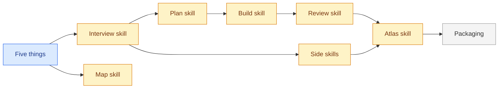

<!--
FORMAT. Agents: read this before editing. It is not rendered.
- Level 1: one paragraph on what this thing is and who or what it touches, then the diagram.
- One ## section per part. The heading, lowercased with dashes, is the part id. Diagram node ids must match, and node labels are the headings.
- Each part carries, in this order: **Status:** sketched | decided | building | done. One purpose line. Needs: the ids of the parts that must be decided before this one, or none. Open questions. Decisions (links). Plan (link to plan/<part>/).
- Part ids are unique across the whole map, including parts split into their own files. A split file starts with `part:` frontmatter and no status; the status line in this file is the truth, derived from the sub-parts: done when all are done, building when any is building, decided when all are at least decided, otherwise sketched.
- Seven to nine parts per diagram at most, flat, no subgraphs. When a part outgrows a screen, move its body to map/<part>.md (which gets its own diagram and sub-parts) and leave the status line and a link.
- The diagram is derived: `flowchart LR`, one node per section coloured by status with the four classes below, one unlabelled edge per Needs entry pointing from the needed part to the part that needs it. Regenerate it from the sections, never the other way round.
-->

# Atlas

Atlas is a set of agent skills plus a file layout (the five things) that take an idea from fuzzy to finished in any domain. It touches a coding agent (Claude Code, Codex, Cursor and others via skills.sh), the project folder it runs in, and optionally GitHub issues. The [2026-09-13 review](notes/2026-09-13-review-atlas-framework.md) records the framework gaps and proposed revision; the linked plan folders hold review follow-up drafts, with existing skill statuses retained pending behavioral validation.

## Five things

**Status:** decided
The file layout every project gets: `GLOSSARY.md`, `MAP.md`, `plan/`, `decisions/`, `notes/`, all at the root, each self-describing.
Needs: none.
Open questions: which lifecycle evidence and decision criteria should every skill share? How should format versions and project overrides travel? Should tracker choice and Git workflow remain coupled?
Decisions: [0002](decisions/0002-five-things-at-the-root.md), [0004](decisions/0004-self-describing-files.md), [0006](decisions/0006-plain-words-over-jargon.md).
Plan: [plan/five-things/](plan/five-things/).

## Atlas skill

**Status:** building
`/atlas` reads the five things and prints five lines: parts by status, ready tasks, newest note, the next command. On a fresh project it creates the five things from `skills/atlas/templates/`, writes the versioned block into `CLAUDE.md` or `AGENTS.md`, asks the tracker question when a GitHub remote exists, offers `git init` when there is no repo, and recommends `Merge: human` when the repo has more than one collaborator. Every later run is a status check: it never re-creates, never re-asks, and reports a missing repo in one word. `/atlas go` runs the next skill and keeps going while no human is needed.
Needs: review-skill, side-skills.
Open questions: how does partial initialization preserve existing content? Which current evidence determines the next action? Which invocation policy can support a bounded go mode?
Decisions: none yet.
Plan: [plan/atlas-skill/](plan/atlas-skill/).

## Interview skill

**Status:** building
`/interview-me` runs rounds of numbered questions with recommended answers, writing terms, map changes, and decisions as they land. On the whole project it drafts the map from what exists and questions the draft; on one part it asks until the open questions are gone, writes the brief, and moves the part to decided. A decided or building part can be re-interviewed; its status stays and its brief changes.
Needs: five-things.
Open questions: which choices need a person and which can be delegated? Where do settled choices live before completion? How does a revised brief identify affected work?
Decisions: [0005](decisions/0005-one-interview-for-both-levels.md), [0008](decisions/0008-the-interview-writes-the-brief.md).
Plan: [plan/interview-skill/](plan/interview-skill/).

## Map skill

**Status:** building
`/map-it` changes the shape only. Bare, it regenerates the map and glossary diagrams from their sections and reports drift; with a part id it splits that part into `map/<part>.md`. New parts come from `/interview-me`; statuses are moved by the skill that causes the change, and a split part's status is recomputed by `/atlas`.
Needs: five-things.
Open questions: how are cycles, split files, and cross-part edges validated? How do splits and renames preserve tasks, decisions, and stable part identity?
Decisions: [0003](decisions/0003-mermaid-in-markdown.md).
Plan: [plan/map-skill/](plan/map-skill/).

## Plan skill

**Status:** building
`/plan-it` turns a decided part's brief into tasks with blocking edges, in one pass, then runs one sizing round with the human. Files in `plan/<part>/`, or sub-issues under the part's parent issue when the project tracks in GitHub. On a re-run it touches todo tasks only.
Needs: interview-skill.
Open questions: how is a brief without tasks recognized? How do reruns preserve ids, cancellations, incoming blockers, and human edits?
Decisions: [0001](decisions/0001-one-home-for-the-plan.md).
Plan: [plan/plan-skill/](plan/plan-skill/).

## Build skill

**Status:** building
`/build-it` works one ready task, one per run, in the medium its Delivers line names and in the way the project already makes that kind of thing, then records what it made, where, and what it verified under Delivered. It moves the task to doing and the part to building. With a `github` tracker it works on a branch and opens a PR; otherwise it works in place and commits when the folder is a git repo. A wrong brief stops it with `Next: /interview-me`.
Needs: plan-skill.
Open questions: how does doing work resume or accept review fixes? How does GitHub preflight precede progress changes? How are owned edits separated from existing user work?
Decisions: [0007](decisions/0007-branches-only-with-github.md).
Plan: [plan/build-skill/](plan/build-skill/).

## Review skill

**Status:** building
`/review-it` runs two checks on a task's result, in a fresh context when the harness has one: does it match the brief, and does it follow the project's conventions (the glossary, the decisions, and how existing things of that kind are made). Findings go on the task, one dated pass per run; boxes only a person can check are listed for the human. A clean review moves the task to done, merges or hands over per the merge line, and moves the part to done when it was the last task.
Needs: build-skill.
Open questions: which delivery and brief revision does a pass certify? How are approval, human waiting, merge, and cancellation distinguished? What proves the overall part outcome?
Decisions: none yet.
Plan: [plan/review-skill/](plan/review-skill/).

## Side skills

**Status:** building
`/prototype-it` makes the smallest thing that answers one part's open question, under `prototypes/<part>-<slug>/`, reports what it shows, takes the human's verdict, files it as a note, and writes the answer back onto the part's open question. `/park-it` pauses into a dated note that `/atlas` resumes from and commits everything in the five things, not only the note.
Needs: interview-skill.
Open questions: what evidence makes a prototype conclusive or inconclusive? How does a handoff remain discoverable and resumable without outranking current state?
Decisions: none yet.
Plan: [plan/side-skills/](plan/side-skills/).

## Packaging

**Status:** sketched
Flat `skills/<name>/` folders, a Claude plugin manifest, a skills.sh listing, a README that doubles as the docs page, and the blog post.
Needs: atlas-skill.
Open questions: which installation paths and harnesses pass a real smoke test? Which fixtures contain verifiable outputs? Which end-to-end results justify marking the skills done?
Decisions: none yet.
Plan: [plan/packaging/](plan/packaging/).
