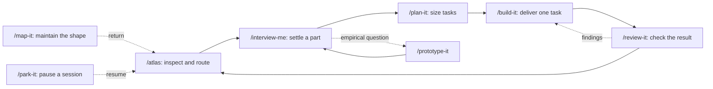

# Atlas

**Map it before you build it.** Atlas is a method and eight agent skills for carrying an idea through questions, a brief, tasks, delivery, and review. Its five things keep the project's words, shape, work, reasons, and dated record in plain Markdown, with GitHub issues as an optional home for the work.

By [Vitali Liouti](https://github.com/somethingdarkside1), inspired by [Matt Pocock's skills](https://github.com/mattpocock/skills).

**Status: working draft, version 0.1.0.** The eight skills and templates exist. The release still needs behavioral testing in a local project and GitHub mode. The [framework review](notes/2026-09-13-review-atlas-framework.md) identifies known problems and proposes a revision; those proposals are not implemented behavior. The [Matt Pocock comparison](notes/2026-09-13-research-matt-pocock-comparison.md) explains what to adopt and why.

## Install and invoke

The repository advertises this skills installer command:

```bash
npx skills add somethingdarkside1/atlas-skills
```

For Claude Code, add the marketplace and then install its plugin:

```bash
claude plugin marketplace add somethingdarkside1/atlas-skills
claude plugin install atlas-skills@atlas-skills
```

Adding a marketplace makes its plugins available; installation is a separate step. See [Claude's plugin installation guide](https://code.claude.com/docs/en/discover-plugins). Local manifests validate; remote installation and all advertised harnesses still need a release smoke test.

This page uses `/atlas` and the other short command names. Claude plugin commands use the plugin namespace, for example `/atlas-skills:atlas`; other installations can expose different invocation forms. Use the name shown by your agent's skill picker. The skills are currently configured for explicit invocation. In Claude, that configuration prevents the automatic skill calls described by `/atlas go`; run the build and review commands individually while that [issue](plan/atlas-skill/03-align-go-with-invocation.md) is open. See [Claude's invocation rules](https://code.claude.com/docs/en/skills#control-who-invokes-a-skill).

Start in a disposable copy of a project. Read the changes after each command. A single Atlas session per checkout is the current working assumption; GitHub mode supplies branches and PRs, but concurrent task claiming and updates remain untested.

## The five things

| Home | Question it answers | Authority |
|---|---|---|
| `GLOSSARY.md` | What do our words mean? | Project terms and distinctions. A term's definition supplies the meaning; its diagram is a view of the definitions. |
| `MAP.md` | What are we building, and how settled is each part? | Part sections, statuses, open questions, and decision dependencies. Its diagram is derived from the sections. |
| `plan/` | What must a part achieve, and what work remains? | A brief and tasks per part, or GitHub parent issues and sub-issues when selected. `plan/README.md` holds the tracker choice and formats in either mode. |
| `decisions/` | Why did we make a consequential choice? | Numbered decisions, with proposed, accepted, and superseded states. |
| `notes/` | What happened in a particular session? | Dated handoffs, prototype verdicts, research, and reviews. Durable conclusions also reach the relevant current home. |

Delivered things live where the project needs them: source files, design assets, copy, or other outputs. `prototypes/` holds experiments. These are work products, rather than extra homes for project state.

The formats travel with the project: a comment at the top of the glossary and map, and a README in each of the three folders. Read the format before editing. The templates under [`skills/atlas/templates/`](skills/atlas/templates/) seed a new project; automatic format migration for existing projects is an [open issue](plan/five-things/02-version-and-migrate-formats.md).

## From an idea to reviewed work



The diagram shows the intended workflow. The review-to-build retry and handoff-to-resume transitions have [known gaps](notes/2026-09-13-review-atlas-framework.md#workflow-failures). `/map-it` is a maintenance command, rather than a mandatory step between every interview and plan.

1. **Start or inspect with `/atlas`.** In a fresh folder it creates the five things and the agent instruction block. It selects file tracking by default, asking about GitHub issues when a GitHub remote exists. On later runs it reports state and recommends a command. It can also change statuses and commit repairs, so it currently does more than inspection.
2. **Draw the project with `/interview-me`.** With no existing parts, it drafts a map from the project and asks questions across that map. This pass identifies the parts and their open questions. It leaves them sketched.
3. **Settle one part with `/interview-me <part>`.** The interview records terms and consequential decisions, resolves the part's open questions, then writes its brief. A question that needs an experiment goes to `/prototype-it` and returns to the interview with a verdict.
4. **Size the work with `/plan-it <part>`.** It reads the brief, drafts complete tasks and their blockers, and runs one sizing round. A task says what it delivers, how to check it, and what counts as done. Dependencies between tasks express work order.
5. **Deliver with `/build-it <task>`.** It starts one ready task, makes the named output, runs applicable checks, and records Delivered. Human-only checks remain for the person. It commits locally when Git exists; GitHub mode additionally uses a branch and PR.
6. **Check with `/review-it <task>`.** It compares the result with the brief and project conventions, records findings, and obtains any human checks. A clean local review completes the task. In GitHub mode completion also depends on merge. Findings lead back to the builder.
7. **Return to `/atlas`, or pause with `/park-it`.** A handoff preserves session context that is absent from the current homes. Its next action is a suggestion that still needs checking against current work, although the current router gives it unconditional precedence.

Use explicit part and task ids while testing. Current no-argument selection, retries, and completion detection need refinement.

## What a part and a task mean

A **part** is something a person could be handed: one purpose, one brief, a status that can move independently. A part's `Needs:` entries name parts that must be decided before it. They describe decision order, not runtime calls, data flow, or task blockers. A map can therefore show useful project structure while still needing a separate diagram to explain how a software system runs.

The current part statuses are `sketched`, `decided`, `building`, and `done`. A brief should exist when a part is decided. A task's current status is `todo`, `doing`, or `done`; readiness is derived from its blockers. The formats have no separate representation yet for interrupted work, changes requested, canceled work, stale review, or a clean PR waiting for merge. See the [proposed transition model](notes/2026-09-13-review-atlas-framework.md#proposed-transition-model) before extending this vocabulary.

The **brief** owns the part's outcome and scope. The **task** owns one piece of delivery and its acceptance checks. A decision explains a consequential choice; a note records what happened. A reviewed task is evidence about that task, while a completed part also needs its overall outcome checked. That last distinction is a proposed improvement, not a separate gate implemented today.

## Skill responsibilities

| Skill | Main inputs | Current writes and effects | Intended stopping point |
|---|---|---|---|
| [`atlas`](skills/atlas/SKILL.md) | Home presence, part and task state, notes, Git state | Creates homes and instruction blocks; repairs some statuses; can close parent issues; commits repairs | Status report and next command, or a human turn in `go` |
| [`interview-me`](skills/interview-me/SKILL.md) | Map, glossary, relevant decisions, brief format | Glossary, map, decisions, brief or parent issue; commit | Project questions recorded, or one part's brief settled |
| [`map-it`](skills/map-it/SKILL.md) | Map sections and glossary definitions | Derived diagrams; split map files; commit | Diagram update and drift report |
| [`plan-it`](skills/plan-it/SKILL.md) | Part, brief, decisions, existing task state | Tasks or sub-issues and blockers; local commit | Sized work accepted in the sizing round |
| [`build-it`](skills/build-it/SKILL.md) | Task, brief, decisions, existing work | Deliverable, task state and Delivered, map status, needed terms and decisions; commit; optional PR | Delivered result or a recorded question |
| [`review-it`](skills/review-it/SKILL.md) | Task, brief, Delivered, actual result, conventions | Review pass, task and part status; optional PR review and merge; commit | Actionable findings or completion |
| [`prototype-it`](skills/prototype-it/SKILL.md) | One part's marked question | Prototype, verdict note, answer on map; commit | Human verdict recorded |
| [`park-it`](skills/park-it/SKILL.md) | Session context, note format, Git changes | Handoff note; currently commits all changes in the five things and prototypes | Handoff written |

These boundaries explain the current files. The [full review](notes/2026-09-13-review-atlas-framework.md#skill-by-skill-review) proposes revised inputs, effects, failure handling, and completion checks for each skill.

## Files and GitHub

`Tracker: files` places each brief at `plan/<part>/brief.md` and its tasks beside it. Work happens in the current checkout, and commits happen when it is a Git repository. `Merge:` has no effect in this mode.

`Tracker: github owner/name` puts the brief in an `atlas:part` parent issue and each task in an `atlas:task` sub-issue. Task dependencies use GitHub's dependency relationship. Delivered and Review are issue comments; the build opens a PR. `Merge: review-it` asks the review skill to squash merge a clean PR. `Merge: human` leaves the PR ready for a person.

This is a meaningful difference in workflow, beyond storage. Current GitHub rules conflate assignment with progress and issue closure with completion, while also requiring merge for done. Branch ordering, author self-review, partial API failures, and completion after a human merge need the [GitHub work](plan/build-skill/02-make-github-start-recoverable.md) and [review work](plan/review-skill/02-verify-github-completion.md) before unattended use is demonstrated.

## Example and review plan

[`examples/brand/`](examples/brand/) illustrates a wordmark and palette project with a brief, three tasks, a decision, and a prototype note. It is a documentation fixture: some tasks claim outputs whose files are absent. It is useful for reading the format; it is not yet a verified finished project or a passing end-to-end test.

The review is tracked in local task files under the existing map parts, linked from [`MAP.md`](MAP.md). Start with [the contract and vocabulary task](plan/five-things/01-settle-workflow-contract.md), then follow its dependent work. The [review's issue index](notes/2026-09-13-review-atlas-framework.md#issue-index) groups the work by urgency. Every task has a concrete output and acceptance checks; none is marked implemented by this documentation update.

The proposed direction is to retain the five things, make transitions and evidence explicit, keep tracker mechanics behind a small shared reference, and test the workflow with realistic failures. New commands should follow demonstrated needs. The comparison with Matt favors sharper interviewing, better diagnostic and prototype methods, and selective shared references, while keeping Atlas's visible project model.

## Contributing and license

Read [`GLOSSARY.md`](GLOSSARY.md), [`MAP.md`](MAP.md), and [`skills/README.md`](skills/README.md) before changing the method. Existing formats and accepted decisions remain authoritative until a revision is adopted. Use the dated review for the diagnosis and the plan for current work.

MIT. See [LICENSE](LICENSE).
