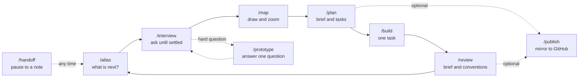
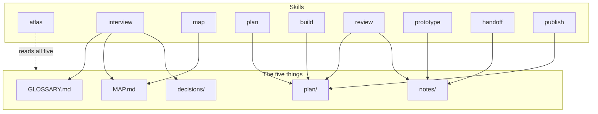

# Atlas

**Map it before you build it.** By [Vitali Liouti](https://github.com/somethingdarkside1). A small set of agent skills that take an idea from fuzzy to finished: interview it, map it, plan it, build it, review it. Works for a website, a CRM rollout, a brand system, or a codebase, because the method is the same and the files are plain Markdown.

Inspired by [Matt Pocock's skills](https://www.aihero.dev/skills), reshaped around one idea: everything the agent learns lands in five places you can read, diff, and draw.

> Status: work in progress. The structure is settled; the skills are being written one at a time.

## Install

```bash
npx skills add somethingdarkside1/atlas-skills
```

Claude Code users can also add it as a plugin:

```bash
claude plugin marketplace add somethingdarkside1/atlas-skills
```

## The five things

Run `/atlas` in any project folder and it creates these, each starting with its own format in a hidden comment so the agent always knows how to write it.

| Path | Holds | One-line rule |
|---|---|---|
| `GLOSSARY.md` | The words | One term per concept the project owns, no implementation detail |
| `MAP.md` | The shape | One diagram, one section per part, a status on every part |
| `plan/` | The work | One folder per part: a brief and numbered tasks with blocking edges |
| `decisions/` | The why | One short file per decision that is hard to reverse |
| `notes/` | The dated record | Write once, never edit; anything durable is copied into a home |

If it is true today it lives in one of the first four. If it was true on a date, it is a note.

## How the skills fit together



What each skill writes:



## The skills

| Skill | What it does | Why it exists |
|---|---|---|
| `/atlas` | Reads the five things and says what to run next. On a fresh project it creates them. | You should never have to remember the method |
| `/interview` | Asks until a part is settled, writing terms, map changes, and decisions as they land | Sharp thinking before any building |
| `/map` | Draws or redraws the map, zooms into one part, moves statuses | The shape stays visible as it fills in |
| `/plan` | Turns a decided part into a brief and numbered tasks with blocking edges | Work that fits one session each |
| `/build` | Works one task in whatever medium it needs, then records what it delivered | The doing |
| `/review` | Checks a task's result against its brief and the project's own conventions | Catches drift before it compounds |
| `/prototype` | Makes a throwaway thing that answers one question, files the verdict as a note | Some questions need a runnable answer |
| `/handoff` | Pauses the session into a dated note the next session resumes from | Nothing gets lost in a temp folder |
| `/publish` | Mirrors the plan to GitHub issues with native blocking links. Optional. | The only skill that knows GitHub exists |

## Credits

Reshaped from Matt Pocock's [skills](https://github.com/mattpocock/skills), MIT.

## License

MIT. See [LICENSE](LICENSE).
