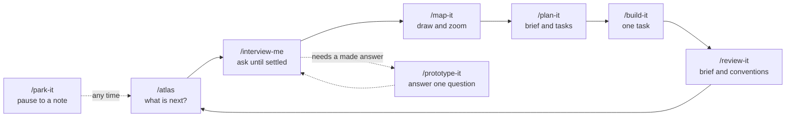
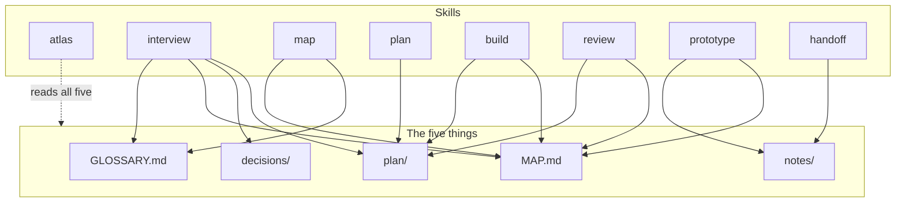

# Atlas

**Map it before you build it.** By [Vitali Liouti](https://github.com/somethingdarkside1). A small set of agent skills that take an idea from fuzzy to finished: interview it, map it, plan it, build it, review it. Works for a website, a CRM rollout, a brand system, or a codebase, because the method is the same and the files are plain Markdown.

Inspired by [Matt Pocock's skills](https://www.aihero.dev/skills), reshaped around one idea: everything the agent learns lands in five places you can read, diff, and draw.

> Status: work in progress. The structure and all eight skills are written; the end-to-end test on a real project is next. Run one Atlas session per checkout at a time; parallel work is what GitHub mode is for.

## Install

```bash
npx skills add somethingdarkside1/atlas-skills
```

Claude Code users can also add it as a plugin:

```bash
claude plugin marketplace add somethingdarkside1/atlas-skills
```

## The five things

Run `/atlas` in any project folder and it creates these, each starting with its own format in a hidden comment so the agent always knows how to write it.

| Path | Holds | One-line rule |
|---|---|---|
| `GLOSSARY.md` | The words | One term per concept the project owns, no implementation detail |
| `MAP.md` | The shape | One diagram, one section per part, a status on every part |
| `plan/` | The work | One folder per part: a brief and numbered tasks with blocking edges. Or, if the project chose it, the repo's GitHub issues |
| `decisions/` | The why | One short file per decision that is hard to reverse |
| `notes/` | The dated record | Write once, never edit; anything durable is copied into a home |

If it is true today it lives in one of the first four. If it was true on a date, it is a note.

A project after a few sessions:

```
my-project/
  GLOSSARY.md               the words, with a diagram of how they relate
  MAP.md                    the shape: one diagram, one section per part, a status on each
  plan/
    README.md               where the plan is tracked, and the brief and task templates
    logo-system/
      brief.md
      01-choose-the-mark.md
      02-build-the-lockups.md
  decisions/
    README.md               the format and a numbered index
    0001-one-mark-not-a-family.md
  notes/
    README.md               the note template
    2026-09-14-prototype-mark-in-three-weights.md
  prototypes/               only if /prototype-it ran: one folder per answered question
    wordmark-three-weights/
```

## How the skills fit together



What each skill writes:



## The skills

| Skill | What it does | Why it exists |
|---|---|---|
| `/atlas` | Prints five lines (parts by status, ready tasks, newest note, problems, the next command). On a fresh project it creates the five things and asks one question: track the plan in files or in GitHub issues. `/atlas go` keeps building and reviewing until a human is needed. | You should never have to remember the method |
| `/interview-me` | Asks in rounds until a part is settled, writing terms, map changes, and decisions as they land, then writes the brief. On a whole project it drafts the map first and questions the draft | Sharp thinking before any building |
| `/map-it` | Redraws the map and glossary diagrams from their sections, reports drift, splits a grown part into its own file | The shape stays visible as it fills in |
| `/plan-it` | Turns a decided part's brief into numbered tasks with blocking edges, after one sizing round | Work that fits one session each |
| `/build-it` | Works one task in whatever medium it needs, then records what it delivered | The doing |
| `/review-it` | Checks a task's result against its brief and the project's own conventions, in a fresh context, and merges or hands over when clean | Catches drift before it compounds |
| `/prototype-it` | Makes the smallest thing that answers one open question, takes your verdict, writes it back to the map and a note | Some questions need a made answer |
| `/park-it` | Pauses the session into a dated note the next session resumes from | Nothing gets lost in a temp folder |

## A worked example

[`examples/brand/`](examples/brand/) is a small brand project after two sessions: two parts on the map, one decided, three tasks, one decision, one note. Copy its shape, not its content.

## Credits

Inspired by Matt Pocock's [skills](https://github.com/mattpocock/skills), MIT.

## License

MIT. See [LICENSE](LICENSE).
