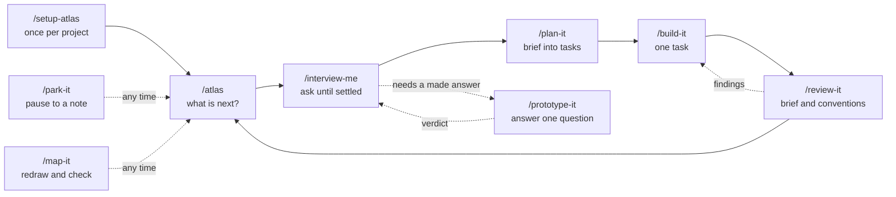
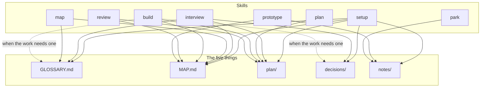

# Atlas

**Map it before you build it.** By **[Vitali Liouti](https://github.com/somethingdarkside1)**. A small set of agent skills that take an idea from fuzzy to finished: interview it, map it, plan it, build it, review it. It works for a website, a CRM rollout, a brand system, or a codebase, because the method is the same and the files are plain Markdown.

Everything the agent learns lands in five places you can read, diff, and draw.

> **Status: draft 0.2, not yet run end to end.** The skills below are written and their read commands are checked, but no full run on a real project has been recorded. There is no tagged release. The [plan](plan/README.md) further down is how the rest gets finished.

## The five things

Run `/setup-atlas` once in any project folder and it creates these. Each starts with its own format in a hidden comment, so the agent always knows how to write it.

| Path | Holds | One-line rule |
|---|---|---|
| `GLOSSARY.md` | The words | One term per concept the project owns, no implementation detail |
| `MAP.md` | The shape | One diagram, one section per part, a status on every part |
| `plan/` | The work | One folder per part: a brief and numbered tasks that say what blocks them |
| `decisions/` | The why | One short file per decision that is hard to reverse |
| `notes/` | The dated record | Write once; anything durable is copied into a home |

If it is true today it lives in one of the first four. If it was true on a date, it is a note.

```
my-project/
  GLOSSARY.md               the words, with a diagram of how they relate
  MAP.md                    the shape: one diagram, one section per part, a status on each
  plan/
    README.md               ids, statuses, and the brief and task templates
    logo-system/
      brief.md
      01-choose-the-mark.md
      02-build-the-lockups.md
  decisions/
    README.md               the format
    0001-one-mark-not-a-family.md
  notes/
    README.md               the note template and the handoff rule
    2026-09-14-prototype-mark-in-three-weights.md
  prototypes/               only if /prototype-it ran: one folder per answered question
    wordmark-three-weights/
```

## How the skills fit together

Every skill ends by printing a `Next:` line, almost always `Next: /command <id>`. That line is the join between them, and `/atlas` can work it out again from the files at any time.



What each skill writes:



`/atlas` reads all five and writes none.

## The skills

| Skill | What it does | Why it exists |
|---|---|---|
| `/setup-atlas` | Creates the five things, or only the ones that are missing, and adds the Atlas block to the project instructions. Asks first. Safe to run again | One safe way in, for a new folder or an old project |
| `/atlas` | Prints five lines: parts by status, ready tasks, the newest handoff, problems with the command that fixes each, and the next command. Changes nothing | You should never have to remember the method |
| `/interview-me` | Asks in rounds until the next work is safe to plan, writing terms, map changes, decisions, and a draft brief as answers land. On a whole project it drafts the map first and questions the draft | Sharp thinking before any building |
| `/plan-it` | Turns a decided part's brief into numbered tasks with blockers, after one sizing round. `/plan-it <part> "<one task>"` adds a single task under an existing brief | Work that fits one session each |
| `/build-it` | Works one task in whatever medium it needs, or picks up one that came back with findings, then records what it delivered and hands it to review | The doing |
| `/review-it` | Checks a task's result against its brief and the project's own conventions, in a fresh context, and marks it done when clean | Catches drift before it compounds |
| `/prototype-it` | Makes the smallest thing that answers one open question, takes your verdict, writes it back to the map and a note | Some questions need a made answer |
| `/park-it` | Pauses the session into a dated note the next `/atlas` resumes from | Nothing gets lost between sessions |
| `/map-it` | Checks the map, redraws the map and glossary diagrams from their sections, sets derived statuses, reports drift, and splits a sketched part into its own file | The shape stays visible as it fills in |

Two ladders carry the state. A part goes sketched, decided, building, done: `/interview-me` decides it, `/build-it` starts it, `/review-it` finishes it. A task goes todo, doing, review, done, or canceled, and the table in every project's `plan/README.md` says which skill makes each move.

Atlas commands save their work the way the project's own `Saving work` section says. By default that is one local commit per command and no push. Branches, pull requests, and merges belong to the project, not to the skills.

## A worked example

[`examples/brand/`](examples/brand/) is a small brand project partway through: two parts on the map, three tasks, one decision, one note. It is a teaching fixture, and some files its tasks name are not there yet. Copy it before you run anything in it.

## Install

```bash
npx skills add somethingdarkside1/atlas-skills
claude plugin marketplace add somethingdarkside1/atlas-skills
claude plugin install atlas-skills@atlas-skills
```

Claude plugin commands use names such as `/atlas-skills:atlas`. Marketplace registration and plugin installation are separate actions; see [the official installation guide](https://code.claude.com/docs/en/discover-plugins). Clean-profile installation is [release work](plan/public-release/02-verify-installation-matrix.md) and has not been verified.

## Finishing the framework

Start at **[INDEX.md](INDEX.md)**. It routes a focus to the right brief and files. The **[active plan](plan/README.md)** has seven work packages and 25 tasks. Under [decision 0021](decisions/0021-patch-the-draft-first.md) the draft was patched first so real use can start; the packages then finish the job:

1. **Core model:** boundaries, task evidence, and migration.
2. **Shared methods:** interviewing, diagnosis, verification, and prototyping, authored once.
3. **Project setup:** adopting existing projects and their own delivery rules safely.
4. **Work skills:** clear reads, changes, finish, and recovery for every operation.
5. **Context routing:** bounded reads, measured.
6. **Validation:** normal and failure paths proven in fresh contexts.
7. **Public release:** documented, installable, verified, and tagged.

The adopted boundaries are in [core-model/01](plan/core-model/01-settle-boundaries.md): Atlas operations create and assess work, shared methods supply the reasoning, and project instructions own commits, branches, PRs, and merges. Tasks live in local files; tracking tasks in GitHub issues and an automatic build and review loop are deferred. Copy a package starter from [the agent prompts](plan/PROMPTS.md) and use [the package issues](plan/COORDINATION.md) to coordinate PRs. The earlier plan is [preserved and mapped](plan/MIGRATION.md).

## Read the analysis

- [The eight skills as a whole: what works, what stops a run, what to cut](notes/2026-09-17-review-skills-as-a-whole.md)
- [Architecture, reusable methods, and project-policy review](notes/2026-09-13-review-methods-and-project-policy.md)
- [Primary-source research on methods, packaging, and focused reads](notes/2026-09-13-research-methods-and-delivery.md)
- [Initial framework review: 28 finding groups and every skill](notes/2026-09-13-review-atlas-framework.md)
- [What to learn from Matt Pocock, and where his framework also has gaps](notes/2026-09-13-research-matt-pocock-comparison.md)

## Development

Read [AGENTS.md](AGENTS.md) for this repository's delivery policy and [skills/README.md](skills/README.md) before changing a skill. Run:

```bash
python3 scripts/check-project.py
claude plugin validate .
claude plugin validate .claude-plugin/plugin.json
bash -n scripts/link-skills.sh
```

## Credit and license

Atlas is authored and published by Vitali Liouti, with inspiration from [Matt Pocock's skills](https://github.com/mattpocock/skills). The comparison notes identify the mechanisms being considered. Adapted source retains its required attribution and notices; original Atlas work remains identified as such.

MIT. See [LICENSE](LICENSE).
