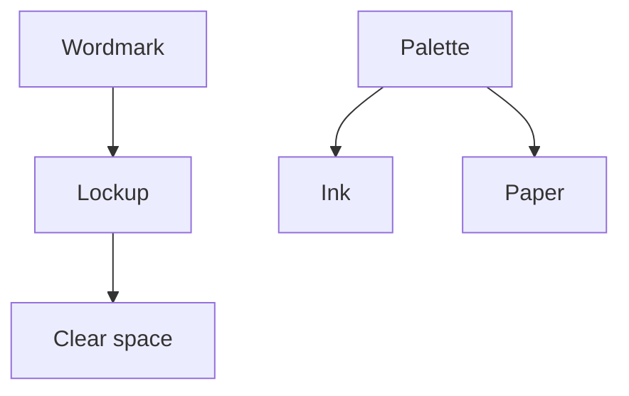

<!--
FORMAT. Agents: read this before editing. It is not rendered.
- One entry per term this project owns. General concepts stay out.
- Entry shape, under the Language heading:
    **Term**:
    One or two sentences saying what it IS.
    _Avoid_: the synonyms
    _Not_: a neighbour easily confused with it, and the one-phrase difference (only when there is one)
- Pick one word per concept. The others go under Avoid.
- No implementation detail. This file is a glossary and nothing else.
- Group entries under ### headings when clusters emerge. When the file outgrows a screen, move each cluster to glossary/<cluster>.md and keep this file as the index with the diagram.
- The diagram (a mermaid `flowchart TB` between the opening line and the Language heading) shows how terms relate: an edge points from a term to a term its definition names, and a term is a node only when it has an edge. Draw it once two terms relate, and redraw it after editing entries.
-->

# Northlight Studio brand

The words used to talk about the studio's visual identity.

## Language

**Wordmark**:
The studio name set in its own drawn letterforms. The only mark the studio has.
_Avoid_: logo, logotype
_Not_: a symbol, which is a mark without letters; the studio has none.

**Lockup**:
A fixed arrangement of the wordmark for one context, such as horizontal or stacked.
_Avoid_: variant, version

**Clear space**:
The empty margin kept around a lockup, measured in x-heights.
_Avoid_: padding, exclusion zone

**Ink**:
The single dark colour used for type and the wordmark.
_Avoid_: black, primary

**Paper**:
The single light colour used for backgrounds.
_Avoid_: white, background colour
