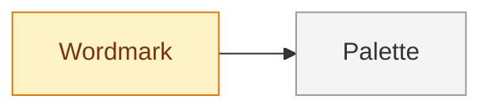

<!--
FORMAT. Agents: read this before editing. It is not rendered.
- Level 1: one paragraph on what this thing is and who or what it touches, then the diagram.
- One ## section per part. The heading, lowercased with dashes, is the part id. Diagram node ids must match, and node labels are the headings.
- Each part carries, in this order: **Status:** sketched | decided | building | done. One purpose line. Needs: the ids of the parts that must be decided before this one, or none. Open questions. Decisions (links). Plan (link to plan/<part>/).
- Part ids are unique across the whole map, including parts split into their own files. A split file starts with `part:` frontmatter and no status; the status line in this file is the truth, derived from the sub-parts: done when all are done, building when any is building, decided when all are at least decided, otherwise sketched.
- Seven to nine parts per diagram at most, flat, no subgraphs. When a part outgrows a screen, move its body to map/<part>.md (which gets its own diagram and sub-parts) and leave the status line and a link.
- The diagram is derived: `flowchart LR`, one node per section coloured by status with the four classes below, one unlabelled edge per Needs entry pointing from the needed part to the part that needs it. Regenerate it from the sections, never the other way round.
-->

# Northlight Studio brand

A visual identity for a two-person architecture studio. It touches the studio's website, proposals, and a shopfront sign, and it is used by the two partners and one freelance designer.

## Wordmark

**Status:** building
The studio name drawn as its own letterforms, with lockups and clear-space rules for every surface.
Needs: none.
Open questions: none.
Decisions: [0001](decisions/0001-one-mark-not-a-family.md).
Plan: [plan/wordmark/](plan/wordmark/).

## Palette

**Status:** sketched
The ink and paper colours, and whether a third colour is ever allowed.
Needs: wordmark.
Open questions: does the shopfront sign need a colour that reads at night? Is one accent colour worth the maintenance?
Decisions: none yet.
Plan: none yet.
