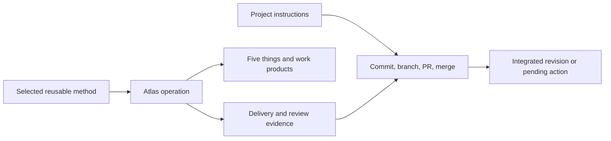

# Reusable methods, project policy, and the public Atlas plan

## Summary
Atlas should own work and its evidence, reusable methods should supply the reasoning, and project instructions should own delivery policy. The recommended first public revision uses local task files, a separate setup operation, a read-only router, and focused context pointers; hosted task tracking and automatic orchestration are deferred until they justify their cost. Seven work packages and 24 tasks turn this direction into a decision, implementation, validation, and publication path under Vitali Liouti's name.

## Detail

### Scope and status of these conclusions

This analysis builds on the [initial framework review](2026-09-13-review-atlas-framework.md), the [Matt Pocock comparison](2026-09-13-research-matt-pocock-comparison.md), and the new [methods and delivery research](2026-09-13-research-methods-and-delivery.md). It considers all eight source skills, their shared rules and templates, project instructions, the initial plan, and the existing second-pass branch.

The current source skills remain an earlier executable draft. This change reorganizes this repository and its active plan; it does not claim to have implemented the replacement operations or tested the proposed release. The new decisions are proposed defaults for the work-package interviews. The user's current instruction authorizes source publication and the push/merge of this plan, which is separate from a tagged, behaviorally validated release.

The initial 23-task plan is preserved in [a dated snapshot](archive/2026-09-13-initial-review/README.md). The [migration table](../plan/MIGRATION.md) maps every old task to current work or explicit deferral. This removes parallel active plans while retaining their evidence.

### Recommendation and alternatives

| Choice | Assessment | Recommended first revision |
|---|---|---|
| Remove all Git/GitHub awareness | Keeps the method small, but loses useful artifact provenance and ignores real project constraints | Retain awareness through applicable project instructions and artifact references |
| Keep native GitHub work tracking inside every skill | Repeats storage and account behavior, makes assignment/closure look like workflow state, and expands testing | Remove provider implementation from the core release path |
| Move the same Git rules into one Atlas plan README | Reduces duplication, but Atlas still owns an unrelated project's delivery choices | Move delivery policy into project instructions |
| Add a generic tracker abstraction now | Gives a formal seam, but asks the first release to solve integration retries and portability without proven demand | Describe future adapter obligations; implement local files first |
| Add a separate setup skill | Makes adoption, migration, and policy discovery explicit; costs one user-facing operation | Add `setup-atlas`; keep `/atlas` for inspection and routing |
| Add standalone methods for every discipline immediately | Makes them discoverable beyond Atlas, but adds invocation and dependency interfaces | Start with shared conditional references; promote a method only after an independent use case is demonstrated |
| Add folders or tags called labels | Gives a visible taxonomy, but cannot by itself change what an agent reads | Use an index of triggers and exact source pointers based on existing part ids |

This is a release sequencing decision. Local-first Atlas still works in a GitHub-hosted repository and can follow a project's PR workflow. What is deferred is GitHub as Atlas's task database, along with the provider-specific synchronization and recovery obligations that entails.

### Three responsibilities with independent reasons to change

**Atlas operations own the work record.** They create a brief or task, make the named result, collect verification, record findings, and update the relevant homes. Their success should be explainable in terms of an output, its evidence, and the resulting work state.

**Shared methods own how to reason.** Interviewing, domain modeling, diagnosis, verification, and experiments can serve several operations. Their output is useful information or evidence. The calling operation decides where that result is persisted and which state transition it permits.

**Project instructions own delivery policy.** Commits, branches, worktrees, pushes, PRs, and merges depend on the repository, team, account, and medium. The same Atlas task may be accepted in a folder without Git, a locally committed design project, or a code repository with branch protection. Those choices should be visible in the project's own instructions and applied by the agent as a separate delivery step.

The shared boundary rule should be short: **Follow applicable project instructions for the project workflow, preserve unrelated work, and report the resulting delivery state accurately.** It is not a universal command to commit or a universal permission to publish. It carries current authorization forward and lets a missing permission block only its dependent action.

### Review, acceptance, and integration

`/review-it` should answer: what was examined, which criteria apply, what evidence supports the result, what failed, and what remains for a person. It should record acceptance or actionable findings for an exact artifact and brief revision. A clean review is not a GitHub approval, a successful merge, or proof that a release exists.

The agent can finish review and immediately continue with an already-authorized project merge. The separation is one of responsibility and evidence; it does not require another command or another permission question on every run. This distinction prevents the skill's quality criteria from changing whenever a team changes merge strategy.

Consider three cases:

1. A brand file passes visual checks in a non-Git folder. Atlas records accepted work with a content identity and the human judgment that applies to it. There is no integration action to invent.
2. A code task passes review on a branch while a person owns merge. Atlas records accepted work and the branch revision. Project delivery reports that integration is pending. A dependent task starts only when it can access the exact accepted output under the project's workflow.
3. An authorized merge requires a conflict resolution. The integrated content differs from what was reviewed. The project step records that revision and reruns the affected checks; an earlier clean review is not silently reused as proof of changed content.

The core-model package must settle the smallest fields needed to represent these distinctions. Avoid encoding every transient condition as a top-level task status. Existing `todo`, `doing`, `review`, `done`, and a cancellation disposition are candidates; a structured delivery/review record can carry waiting and freshness. The active planning files use simple states and contain no claim that this candidate format is already implemented by the source skills.

### What each operation should read, change, and finish

All operations read applicable project instructions and the format of the homes they will change. The table names additional scope. The exact field contract is adopted in [core-model](../plan/core-model/brief.md), then implemented in [work-skills](../plan/work-skills/brief.md).

| Operation | Additional reads | Owned changes | Finished when | Recovery |
|---|---|---|---|---|
| `setup-atlas` | Existing homes, project conventions, instruction targets, migration version | Missing homes, adopted managed pointer, explicitly selected policy text | Required state exists, existing content is accounted for, rerun is stable | Adoption diff and unresolved incompatibility identify the next step |
| `atlas` | Compact part/task state and relevant live handoff pointers | None during ordinary inspection | The report names a valid next action or explains why none is eligible | Invalid state is reported with a specific repair target |
| `interview-me` | Relevant part, terms, decisions, current brief, affected work on revision | Terms, part questions, decisions, draft/current brief | Scoped uncertainty is resolved or explicit assumptions make the next task safe | Settled choices and unresolved questions persist |
| `map-it` | Sections, resolved ids, cross-part edges, relevant term relationships | Derived views; expressly selected split or rename migration | Views agree with valid source and identity survives structural changes | Report ambiguity instead of treating a drawing change as a decision |
| `plan-it` | Current brief, full bodies of tasks it revises, incoming blockers | Tasks, checks, scope coverage, cancellation history, dependencies | Work is complete enough to start and reruns preserve identities | Partial creation is resumed; changed scope identifies affected work |
| `build-it` | Task, brief, accepted decisions, relevant neighboring work, selected methods | Named output, delivery evidence, task progress, required terms/decisions | The identified result and its actual checks exist | Resume the same attempt or record a blocking question |
| `review-it` | Fixed delivery and scope revision, acceptance criteria, applicable standards and context | Review evidence, findings, acceptance, justified part outcome | Every criterion is evidenced, a finding, or a recorded human judgment | Findings return to the identified task and stale evidence is invalidated |
| `prototype-it` | One question, relevant context, selected experiment method | Experiment, observation/verdict note, answer pointer | Evidence and limits answer the question or establish an inconclusive next step | Preserve each run and the next discriminating experiment |
| `park-it` | Current task/attempt pointers and session-only state | Dated handoff | A fresh session can validate the target and resume | Current state overrides a stale suggested command |

An operation's **finished** is its own postcondition. A finished diagnosis may conclude that evidence is insufficient; it does not mean the bug is fixed. A finished prototype may be inconclusive. A finished review may contain findings. Keeping those meanings precise avoids equating "the skill returned" with "the project is done."

### Reusable interviewing and domain modeling

A shared interviewing method should identify the consequential uncertainty, discover accessible facts, show concrete cases, and ask the person only for choices that remain theirs. Domain modeling belongs in this loop where an overloaded term or boundary changes behavior: distinguish a task from a work package, acceptance from integration, and current evidence from a dated observation.

Its inputs are a scoped question, relevant known facts and terms, and existing decisions or delegated preferences. Its output separates settled choices, assumptions, unanswered questions, and affected terms or boundaries. The method does not create a GitHub issue or declare a part decided; the caller owns that persistence and transition.

Improve on the inspected Matt pattern by making the stopping rule proportional to the next work and preserving small settled choices across interruption. Relentlessness is useful when a consequential assumption is being skipped, but a routine correction should not require an exhaustive interview. A preferred option can be supplied without treating an unanswered material question as consent. See the [interview-method task](../plan/shared-methods/01-interview-and-model.md).

### Reusable diagnosis

Diagnosis should establish an observable symptom, distinguish evidence from hypotheses, choose a discriminating next check, and retain what was learned. The minimum useful result is a reproduction or an explicit reproduction limit, supported or weakened explanations, and the next justified action.

Use this from a builder whose check fails, a reviewer encountering an unexplained regression, or an interview where a reported constraint may be an existing defect. The method should work with the medium: a software trace, a broken data join, or a process walkthrough can each provide a failing signal. It should not force application tests onto every non-code task.

Improve on the reference through a consistent return to Atlas's work record: the symptom, evidence, uncertainty, and proposed correction are attached to a resumable task or relevant note. Bound investigation when new evidence stops arriving. See the [diagnosis task](../plan/shared-methods/02-diagnose-with-evidence.md).

### Reusable verification

Verification chooses observations that would distinguish correct from incorrect output, executes those it can, and reports results against an exact input revision. It distinguishes a passed check, an unavailable check, an unperformed check, and a human-only judgment.

The same method supports a builder checking its output and a reviewer independently checking acceptance. The reviewer needs a different context and question, not a duplicate generic instruction to "be thorough." A content hash or other revision identity matters when Git is absent; a commit hash alone is insufficient if uncommitted changes were included in the examined artifact.

Improve on the reference by binding evidence to both output and scope, covering non-code checks explicitly, and maintaining the finding-to-correction loop. Automated tests are useful when they protect behavior; a test that only reproduces the implementation adds little confidence. See the [verification task](../plan/shared-methods/03-verify-by-medium.md).

### Reusable prototyping

The method should start with a question and an observation that would change the decision. It selects the smallest experiment, names the time/resource bound, and reports observations, limitations, and the verdict or next experiment.

UI preference needs contrasting artifacts and a person's judgment. A state-machine question may need test cases, persistence, or failure handling. Those mechanisms are allowed when they are the thing being investigated. A prototype does not gain production readiness merely because another task copies its code or files.

Improve on the reference by retaining the broad media support already present in Atlas and adding a durable link from the experiment to the decision it informs. Preserve inconclusive results instead of forcing a yes/no verdict. See the [prototype task](../plan/shared-methods/04-prototype-to-learn.md).

### Author once, package where it is needed

A root methods directory is a good authoring home, but it is not automatically an installed dependency. A user who installs only `build-it` may not receive a sibling method skill or a repository-level file. Treat the installation unit as a real boundary.

The recommended source layout is one canonical file per method plus an explicit consumer map. The build/check process generates a method reference inside every installable skill that requires it. Each copy declares its source and revision; the checker detects drift. That is controlled distribution, not multiple authoritative definitions. Package only the references a consumer actually needs and have the operation open them conditionally.

An alternative is to require installing the full Atlas bundle. It is simpler to implement and narrower to support. The public-release package should advertise only the path that passes clean-profile tests. Promoting methods into model-invoked skills is a further product choice, useful when people independently ask for that discipline and the host supports the invocation chain. The default proposal avoids spending an always-loaded description for each method before that benefit is demonstrated.

Current Claude documentation treats explicit-only skill invocation as a real boundary; reading a sibling skill to imitate an unavailable invocation is not a reliable orchestration design. The [research note](2026-09-13-research-methods-and-delivery.md) cites current official packaging and invocation documentation. For the first revision, keep public operations explicit and routing manual. Automatic `go` is deferred rather than shipped with an untested exception.

### Setup should adopt policy, not invent permissions

A separate setup skill has a different job and completion condition from orientation. It inventories existing context, identifies missing homes, maps legacy material, and adds a small pointer to the project instructions. Repeated setup must preserve populated files, custom sections, linked instruction targets, and the user's previous choices.

When a project already describes commits and PRs, setup should point to and preserve that policy. When policy is absent, it can propose a small block appropriate to the project's actual workflow. Ask about consequential missing choices only when the next work requires them. A non-Git folder needs no branch strategy. A project with no hosted tracker needs no GitHub account question.

The generated Atlas block should state the method boundary and locations, while the project owns the surrounding delivery instructions. Setup should not infer merge permission from contributor count, grant push rights through a template, or change account/repository configuration merely to make defaults work. Existing authorization still applies, so adopting a setup block does not create another approval step for an action the user already requested.

This repository now demonstrates the split in [AGENTS.md](../AGENTS.md), which resolves to [CLAUDE.md](../CLAUDE.md). Its delivery policy is specific to developing Atlas and the currently authorized push/merge. It is not a template that every downstream project must inherit. The [setup package](../plan/project-setup/brief.md) produces and tests the downstream adoption procedure.

### What a future GitHub adapter would have to earn

A future adapter should implement the same work semantics as local files: stable ids, parent membership, blockers, cancellation, revision-bound evidence, and recoverable writes. It must read complete paginated state, distinguish assignment from progress, reuse partially created objects, preserve native URLs, and handle unavailable permissions or features.

It should own task storage only. Branches and PRs remain the project workflow even when GitHub stores the task. A local task can have a PR, and a GitHub task can deliver a non-code artifact with no PR. Those are essential cases for the adapter contract.

Do not add bidirectional mirroring as a shortcut. If an existing GitHub-tracked Atlas project needs migration, export a reviewable snapshot, map ids and links, reconcile active work, then make the authority switch explicit. The original source remains available as history. Gate adapter implementation on at least one real project need and the same behavior tests as the local provider.

The first plan's GitHub implementation tasks are therefore explicitly deferred or absorbed into project-policy tests, rather than silently marked completed. Their [migration mapping](../plan/MIGRATION.md) preserves the reasons.

### Labels, directories, and actual context cost

A directory of labels reduces context only if the agent follows a smaller set of reliable pointers as a result. Renaming folders into categories does not make file contents cheaper. A separate taxonomy can create more decisions: whether a file is architecture, design, domain, planning, or all four, and who keeps the labels current.

Use the part ids already owned by the map. [INDEX.md](../INDEX.md) maps a focus to its trigger and exact authoritative files. A selected task brings its brief, acceptance, required decisions, relevant format, and the method branch needed now. Diagrams, archives, and full history are loaded when the question requires them.

The index is navigation, not a second task database. It does not duplicate status or decide ownership from a label. Expand scope when a change crosses an interface, a dependency points elsewhere, an assumption is unsupported, or a check fails outside the selected part. Both sides of a changed boundary matter even if the initial focus was narrow.

Measure loaded bytes and file reads, and report actual tokenizer counts only when a tokenizer was used. Compare evidence found, failures caught, interruptions, and useful output as well as context size. The current reorganization improves navigation; it makes no numerical token-saving claim. See the [context package](../plan/context-routing/brief.md).

### How Atlas can be distinct and better

The differentiator should be a reliable shared record with interchangeable methods and project-owned workflow. Matt's methods provide useful depth; Atlas can improve the joins between learning, planning, execution, acceptance, and resumption, across both code and non-code work.

Evidence for that claim should come from concrete cases: a small correction without a needless interview; an interrupted task resumed without chat history; a real finding fixed and re-reviewed; a changed brief invalidating obsolete acceptance; and the same work method under two project delivery policies. Compare these cases against the current Atlas and inspected Matt route. Document both improvements and regressions.

Keep the public story small: set up the project, select the next work, use the right method, make the result, verify it, record what changed, and follow the project's workflow. The complexity belongs in precise conditional guidance and tests, not in a large mandatory questionnaire or a proliferation of public commands.

### Existing second-pass work

The local branch `claude/skill-list-analysis-d40ccf`, at `7f1f12d`, contains a prior second pass. It centralizes task ids and statuses, introduces a review state, preserves waits, improves some commit scopes, and treats homes as authoritative. Those changes are useful candidate material for the core-model and work-skills packages.

It also keeps Git policy in `plan/README.md`, assumes sibling skill access for automatic continuation, and remains behaviorally untested according to its own handoff. Its conclusions therefore need reconciliation with this project's newer requested direction. Preserve that branch as `codex/second-pass-reference` in the public repository so a future agent can inspect its commits without searching a local worktree. Decision numbers 0009 through 0011 belong to that branch and remain reserved; new proposals start at 0012.

### The work packages and sequence

| Package | What it produces | Main dependency |
|---|---|---|
| [Core model](../plan/core-model/brief.md) | Adopted boundaries, task/evidence contract, legacy migration | Starts the plan |
| [Shared methods](../plan/shared-methods/brief.md) | Four reusable methods and self-contained distribution | Accepted boundaries |
| [Project setup](../plan/project-setup/brief.md) | Safe setup and project-policy adoption | Boundaries, then migration |
| [Work skills](../plan/work-skills/brief.md) | Eight consistent operations and provider-free core | Contract, relevant methods, setup |
| [Context routing](../plan/context-routing/brief.md) | Resolvable focused reads and measured context results | Contract, then actual revised operations |
| [Validation](../plan/validation/brief.md) | Fixtures, structural checks, independent behavioral evidence | Contract first; integrated operations for final runs |
| [Public release](../plan/public-release/brief.md) | User docs, provenance, tested installation, tagged release | Installation and behavioral evidence |

Each package starts from a brief with a concrete interview prompt, unresolved choices, read scope, owned files, and its finish condition. Tasks have blocker ids and observable acceptance. The first task settles the remaining material design choices using the proposed defaults; it does not ask the user to repeat already accepted directions. Once the core boundary is adopted, several method and setup tasks can proceed independently. Shared files still require coordinated ownership or isolated worktrees.

The plan is definitive about ownership, sequence, evidence, and release gates. It deliberately leaves implementation choices with named tasks rather than pretending those decisions have been answered. Future agents can pick a package from the index, settle its remaining choices, complete one eligible task, and use project policy for commits and integration.

### Publication and validation boundary

The source repository is `somethingdarkside1/atlas-skills`, attributed to Vitali Liouti. Public source can include a clearly marked work-in-progress plan. A validated skill release additionally requires a fixed candidate revision, clean-profile installation, complete method dependencies, realistic software and non-code runs, accurate documentation, preserved credit for adapted material, and a verified public installation route.

This change validates active-plan structure, references, metadata, and archive migration through `scripts/check-project.py`, plus manifest and shell syntax checks. Behavioral tests remain tasks. Record actual PR, merge, and source revision in the completion handoff after those actions succeed; a plan to push is not evidence of a push.

## Copied into

[INDEX.md](../INDEX.md), [MAP.md](../MAP.md), [GLOSSARY.md](../GLOSSARY.md), [project instructions](../AGENTS.md), [skill authoring guidance](../skills/README.md), proposed [decisions](../decisions/README.md), and the seven active packages under [plan/](../plan/README.md). The dated initial plan is preserved under [notes/archive/](archive/2026-09-13-initial-review/README.md).
