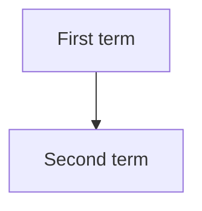

<!--
FORMAT. Agents: read this before editing. It is not rendered.
- One entry per term this project owns. General concepts stay out.
- Entry shape: **Term**: one or two sentences saying what it IS. Then `_Avoid_: the synonyms`. Then, only when a neighbour is easily confused with it, `_Not_: the neighbour, and the one-phrase difference`.
- Pick one word per concept. The others go under Avoid.
- No implementation detail. This file is a glossary and nothing else.
- Group entries under ### headings when clusters emerge. When the file outgrows a screen, move each cluster to glossary/<cluster>.md and keep this file as the index with the diagram.
- The diagram shows how terms relate: an edge points from a term to a term its definition names, and a term is a node only when it has an edge. Redraw it after editing entries.
-->

# {Project name}

The words used to talk about {project}, one entry per concept it owns.

## Language

**{Term}**:
{One or two sentences saying what it is.}
_Avoid_: {synonyms}
