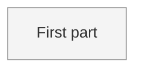

<!--
FORMAT. Agents: read this before editing. It is not rendered.
- Level 1: one paragraph on what this thing is and who or what it touches, then the diagram.
- One ## section per part. The heading, lowercased with dashes, is the part id. Diagram node ids must match.
- Each part carries, in this order: **Status:** sketched | decided | building | done. One purpose line. Open questions. Decisions (links). Plan (link to plan/<part>/).
- Part ids are unique across the whole map, including parts split into their own files. A split file starts with `part:` frontmatter and no status; the status line in this file is the truth.
- Seven to nine parts per diagram at most. When a part outgrows a screen, move its body to map/<part>.md (which gets its own diagram and sub-parts) and leave the status line and a link.
- Colour by status with the four classes below. Regenerate the diagram from the sections, never the other way round.
-->

# {Project name}

{One paragraph: what this is, who and what it touches.}

## First part

**Status:** sketched
{One purpose line.}
Open questions: {what the interview must settle}.
Decisions: none yet.
Plan: none yet.
