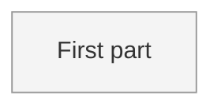

<!--
FORMAT. Agents: read this before editing. It is not rendered.
- Level 1: one paragraph on what this thing is and who or what it touches, then the diagram.
- One ## section per part. The heading, lowercased with dashes, is the part id. Diagram node ids must match, and node labels are the headings.
- Each part carries, in this order: **Status:** sketched | decided | building | done. One purpose line. Needs: the ids of the parts that must be decided before this one, or none. Open questions: `none`, or one `- ` line per question. Decisions (links). Plan (link to plan/<part>/, or to the parent issue).
- An open question may start with a marker: `(prototype)` when only a made thing can answer it; `(answered, see notes/<file>) <verdict>` once one has, until the interview copies the verdict into the brief or a decision and removes the line.
- Part ids are unique across the whole map, including parts split into their own files. A split file starts with `part:` frontmatter and no status; the status line in this file is the truth, derived from the sub-parts: done when all are done, building when any is building, decided when all are at least decided, otherwise sketched.
- At most nine parts per diagram, flat, no subgraphs. When a part outgrows a screen, move its body to map/<part>.md (which gets its own diagram and sub-parts) and leave the status line and a link.
- The diagram is derived: `flowchart LR`, one node per section coloured by status with the four classes below, one unlabelled edge per Needs entry pointing from the needed part to the part that needs it. Regenerate it from the sections, never the other way round. A skill that moves a status also changes its own node's class; `/map-it` makes the whole block true again.
-->

# {Project name}

{One paragraph: what this is, who and what it touches.}

## First part

**Status:** sketched
{One purpose line.}
Needs: none.
Open questions:
- {What the interview must settle.}
Decisions: none yet.
Plan: none yet.
